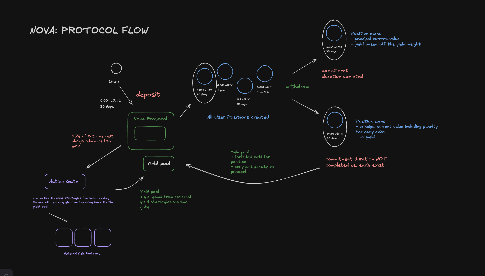

# Nova

Nova is a **yield-bearing commitment savings protocol** built on StarkNet that allows users to deposit bridged wBTC with a **flexible commitment duration**, earning yield while maintaining the ability to withdraw at any time. Unlike traditional lockups, Nova empowers users with choice—deposit like a savings account, earn like a staking protocol, and exit whenever needed.

At its core, Nova creates a **fair and incentive-aligned ecosystem** where:

- **Users protect their principal** through share-based accounting (losses are socialized fairly across all positions on occurence)
- **Users earn yield** from deployed gate strategies and early exit penalties
- **Gates benefit from stable liquidity** promised by commitment durations (the longer users commit, the more wBTC Nova can confidently deploy)

---

## Key Concepts & Terminology

Before diving into how Nova works, here are the core terms you need to know:

### **Position**

A position is created when a new deposit is made. Each position tracks:

- How much wBTC you deposited
- When your commitment ends i.e. commitment duration (30 minutes to 2 years)
- Your share of the principal pool (via `nova-shares`, internal accounting)
- Your share of the yield pool (postion weight)
- A label/goal name (optional)

You can have up to 7 positions at once.

---

### **Principal**

The original amount of wBTC you deposited. Your principal is protected through share-based accounting (nova_shares). If the underlying gate experiences losses, they are shared proportionally across all users—your principal value decreases accordingly. Your principal can only decrease or remain the same; it never increases from gate gains. Yield is tracked separately and doesn't affect your principal value.

---

### **Principal Pool**

The combined wBTC from all user deposits, managed through share-based accounting with nova_shares. When the gate experiences losses, they are shared proportionally across all users through changes in share value. Does not include any yield accrued.

---

### **Nova Shares**

Your ownership stake in the principal pool. We use share-based accounting instead of fixed amounts so that losses from external yield protocols are shared proportionally across all users,

---

### **Yield Pool**

The yield pool is the pool where all yield generated is sent to and is dfferent from the principal pool. Yield is generated from two different sources in nova.

1. **Gate strategy harvests** – Returns generated by deployed capital from an external yield prootocol via the gate.
2. **Early exit penalties** – Penalties paid by users who withdraw early and exit their positions.

The yield pool is distributed to all active positions based on their **position weight**.

---

### **Position Weight**

A number that determines how much of the total yield pool your position receives at the end of its commitment duration. Calculated as:

`Position Weight = Deposit_Amount^1.5 × Commitment_Duration`

This formula rewards both larger deposits and longer commitments, incentivizing stable liquidity for external protocols.

An example would be:
User 1 => 0.5 wBTC, 7,776,000 sec => 0.5^1.5 × 7,776,000 = 2,748,654
User 2 => 0.8 wBTC, 3,888,000 sec => 0.8^1.5 × 3,888,000 = 2,763,889
User 3 => 0.5 wBTC, 5,184,000 sec => 0.5^1.5 × 5,184,000 = 2,062,509
Total => 2,748,654 + 2,763,889 + 2,062,509 = 7,575,052

**Example:** A 5 wBTC yield pool distributed across three users:

| User      | Deposit  | Duration (seconds) | Position Weight | Yield Share  |
| --------- | -------- | ------------------ | --------------- | ------------ |
| 1         | 0.5 wBTC | 7,776,000          | 2,748,654       | 1.817 wBTC   |
| 2         | 0.8 wBTC | 3,888,000          | 2,763,889       | 1.827 wBTC   |
| 3         | 0.5 wBTC | 5,184,000          | 2,062,509       | 1.363 wBTC   |
| **Total** | —        | —                  | **7,575,052**   | **5.0 wBTC** |

Your earned yield is added to your principal, increasing your total position value.

---

### **Gate**

A yield strategy adapter that bridges Nova to external DeFi protocols. It:

- Wraps one or more external yield protocols
- Is swappable, Nova maintains one active gate at a time
- Deploys Nova's wBTC into yield strategies (e.g., staking pools, lending protocols)
- Earns returns and reports them back to Nova's yield pool
- Can be changed when a better strategy emerges

Example could be a gate that connects Nova to yield on Ekubo, Vesu and other yield protocols.

---

### **Early Exit Penalty**

If you withdraw before your commitment duration ends, you pay:

`Penalty = Principal_Value × (Remaining_Time / Total_Duration)`

This penalty goes into the yield pool and is distributed to users who stayed committed based off their position weight as shown earlier.

So on the one hand you have stable liquidity that can be used by external protocols in the gate to earn yield because users dont want to pay a penalty, or if they do pay the penalty for early withdrawal compromising the yield from the gate, their penalty for that withdrawal then serves as a source of yield.

---

### **Deployment Ratio**

Nova keeps 75% of the principal pool in the contract for withdrawal liquidity and deploys 25% to the active gate for yield generation. The protocol automatically rebalances after every deposit, withdrawal, and top-up to maintain this target. If the deployed amount falls below 25%, Nova deploys more; if it exceeds 25%, Nova withdraws the surplus back to the contract.

---

### **Stable Gate Liquidity**

A view-signal to external protocols: _"This much wBTC from users is locked for 1,209,600+ seconds (14+ days)—you can rely on it."_
Based off the pricnipal pool, as that is what is being deployed to the gate.

**Breaking down the multipliers:**

- **0.25** = Deployment Ratio (only 25% of the principal pool is actually deployed to the gate)
- **0.75** = Confidence Factor (conservative estimate that not all 1,209,600+ sec (14d+) positions will be held to completion—some users exit early, so this accounts for ~75% actually staying stable)

External protocols use this to gauge how much wBTC Nova can reliably keep deployed with them over the next 1,209,600 seconds (14 days).

---

### **Top-Up**

Add more wBTC to an existing position without creating a new one. Your principal increases by the additional amount, and your position weight is recalculated. For the top up amount, the weight is calculated using the remaining duration at the time of the top up, not the original commitment period—ensuring fair yield distribution based on actual commitment length.

---

## User Interaction Flow

When you deposit wBTC into Nova, you specify both an amount and a commitment duration—Nova creates a position that represents your stake in the protocol. You can have up to 7 positions simultaneously, letting you stack different commitment lengths or goals.

From that moment, you face a simple choice: wait out your commitment duration or exit whenever you want.

**If you hold to the end**, your commitment expires and you withdraw two things: your principal (the original deposit, fairly adjusted if the gate experienced losses) plus your pro-rata share of the accumulated yield pool, distributed based on your position weight. The longer you committed and the larger your deposit, the more yield you receive.

**If you exit early**, you get immediate access to your funds—but you pay a cost. You forfeit all yield you would have earned, and you lose a portion of your principal as an early exit penalty. The penalty is calculated as `Principal × (Remaining_Time / Total_Duration)`. For example, if you committed for 90 days but exit after 70 days, you give up 22% of your principal as a penalty. That penalty immediately joins the yield pool and gets distributed to users who eventually stay committed.

This creates a natural incentive loop: some users avoid the penalty and keep their deposits locked, ensuring the protocol maintains stable capital to deploy into gates for external yield protocol generation. When other users do exit early compromsing that stable liquidity, their penalties flow into the yield pool, rewarding those who stayed. Either way, yield is constantly being generated.

**How yield gets generated in the first place** comes from two sources. First, when you and other users pool deposits together, Nova takes 25% of the total principal pool and deploys it into external yield protocols via what we call a gate, a wrapper to other yield generation strategies (e.g. Ekubo, Troves, Vesu etc.). That gate continuously earns returns and feeds them back into Nova's yield pool. Second, every early exit adds a penalty to the yield pool. These two streams of yield accumulate, and when positions mature, all active yield is distributed to those who completed their commitments.

After every deposit, withdrawal, or top-up, Nova automatically rebalances to maintain the 25% deployment target. This keeps the protocol efficient: enough wBTC stays in the contract buffer for withdrawal liquidity in case of a large withdrawal or withdrawal rush, while enough is deployed to external yield sources to keep earning. It's a continuous balancing act that happens transparently. That 25% target can always be raised to a higher value if liquidty has been stable for a ong duration.

The brilliance of this design is alignment. Users who want yield stay committed, providing stable liquidity to the gate. Users who need early liquidity by withdrawing for emergencies pay a fair price that rewards those who stayed. External protocols get reliable, predictable capital they can deploy. And everyone benefits from a system where yield flows constantly—whether from external protocols or from users who chose to exit early.

--

## Complete Yield Distribution Example

This walkthrough tracks three users' positions from deposit through full withdrawal, showing how losses are socialized, yield is accrued, and withdrawals are rebalanced.

### Setup: Initial Deposits

All three users deposit at **T=0**:

| User      | Deposit      | Duration (sec) | Position Weight | Nova Shares | Original Principal |
| --------- | ------------ | -------------- | --------------- | ----------- | ------------------ |
| 1         | 0.5 wBTC     | 7,776,000      | 2,748,654       | 0.5         | 0.5 wBTC           |
| 2         | 0.8 wBTC     | 3,888,000      | 2,763,889       | 0.8         | 0.8 wBTC           |
| 3         | 0.5 wBTC     | 5,184,000      | 2,062,509       | 0.5         | 0.5 wBTC           |
| **Total** | **1.8 wBTC** | —              | **7,575,052**   | **1.8**     | **1.8 wBTC**       |

**Protocol State at T=0:**

- Total deposits: 1.8 wBTC
- Principal pool: 1.8 wBTC
- Deployed to gate (25%): 0.45 wBTC
- Contract buffer (75%): 1.35 wBTC
- Yield pool: 0 wBTC
- Share value: 1.8 / 1.8 = 1.0 wBTC per share
- Total weight: 85.231

---

### Step 1: Gate Experiences a 10% Loss

**T=10,000 sec** - The underlying yield protocol has a drawdown:

- Gate value drops: 0.45 → 0.405 wBTC (loss of 0.045 wBTC)
- Losses are socialized via share-based accounting
- New principal pool: 1.35 (buffer) + 0.405 (gate) = 1.755 wBTC
- **New share value: 1.755 / 1.8 = 0.975 wBTC per share**

**Impact on each user's principal:**

| User | Nova Shares | Share Value | Principal Value | Loss   |
| ---- | ----------- | ----------- | --------------- | ------ |
| 1    | 0.5         | 0.975       | 0.4875          | 0.0125 |
| 2    | 0.8         | 0.975       | 0.78            | 0.02   |
| 3    | 0.5         | 0.975       | 0.4875          | 0.0125 |

Each user's principal decreased fairly—losses were distributed proportionally by their share of the pool.

---

### Step 2: Gate Accrues Yield

**T=50,000 sec** - The gate earns from its yield strategies (e.g., staking rewards):

- Gate yield accrued: 0.12 wBTC
- **Yield goes directly to the yield pool, NOT added to gate value**
- Gate value remains: 0.405 wBTC (unaffected by yield accrual)
- Contract buffer: 1.35 wBTC (unchanged)
- Principal pool: 0.405 + 1.35 = 1.755 wBTC (unaffected by gate gains)
- Yield pool: 0.12 wBTC (newly accrued)
- **Share value remains: 0.975** (only losses affect principal, not gains)

**Protocol State:**

- Gate deployed: 0.405 wBTC
- Contract buffer: 1.35 wBTC
- **Principal pool: 0.405 + 1.35 = 1.755 wBTC** (derived from gate + buffer)
- Yield pool: 0.12 wBTC
- Total assets: 1.755 + 0.12 = 1.875 wBTC
- Share value: 0.975 (unchanged)

---

### Step 3: User 2 Withdraws at Commitment End

**T=3,888,000 sec** - User 2's 45-day commitment expires:

**Withdrawal calculation:**

- Principal value: 0.8 × 0.975 = 0.78 wBTC
- Yield allocation: 0.12 × (2,763,889 / 7,575,052) = 0.0438 wBTC
- **Total withdrawal: 0.78 + 0.0438 = 0.8238 wBTC**

**Before User 2 withdrawal:**

- Gate deployed: 0.405 wBTC
- Contract buffer: 1.35 wBTC
- Principal pool: 0.405 + 1.35 = 1.755 wBTC
- Yield pool: 0.12 wBTC

**After transfer to user:**

- Buffer now: 1.35 - 0.78 = 0.57 wBTC (principal withdrawn reduces buffer)
- Gate deployed: 0.405 wBTC (unchanged)
- **Principal pool: 0.405 + 0.57 = 0.975 wBTC** ✓
- Yield pool now: 0.12 - 0.0438 = 0.0762 wBTC (0.0438 yield withdrawn)

**Rebalance gate to 25% of new principal:**

- Target gate: 0.975 × 0.25 = 0.24375 wBTC
- Current gate: 0.405 wBTC
- Withdraw from gate: 0.405 - 0.24375 = 0.16125 wBTC

**After rebalance:**

- Buffer: 0.57 + 0.16125 = 0.73125 wBTC
- Gate deployed: 0.24375 wBTC
- **Principal pool: 0.24375 + 0.73125 = 0.975 wBTC** ✓
- Yield pool: 0.0747 wBTC
- Total assets: 0.975 + 0.0747 = 1.0497 wBTC

---

### Step 4: Gate Accrues More Yield

**T=5,000,000 sec** - The gate continues to earn:

- Gate yield accrued: 0.08 wBTC
- **Yield goes directly to the yield pool**
- Gate deployed: 0.24375 wBTC (unchanged)
- Contract buffer: 0.73125 wBTC (unchanged)
- **Principal pool: 0.24375 + 0.73125 = 0.975 wBTC** (unchanged)
- Yield pool: 0.0762 + 0.08 = 0.1562 wBTC
- Total assets: 0.975 + 0.1562 = 1.1312 wBTC

---

### Step 5: User 3 Withdraws at Commitment End

**T=5,184,000 sec** - User 3's 60-day commitment expires:

**Withdrawal calculation (after User 2 is gone, only User 1 and 3 remain):**

- Remaining weight: 2,748,654 + 2,062,509 = 4,811,163
- User 3's yield allocation: 0.1562 × (2,062,509 / 4,811,163) = 0.0667 wBTC
- Principal value: 0.5 × 0.975 = 0.4875 wBTC
- **Total withdrawal: 0.4875 + 0.0667 = 0.5542 wBTC**

**Before User 3 withdrawal:**

- Gate deployed: 0.24375 wBTC
- Contract buffer: 0.73125 wBTC
- Principal pool: 0.24375 + 0.73125 = 0.975 wBTC
- Yield pool: 0.1547 wBTC

**After transfer to user:**

- Buffer now: 0.73125 - 0.4875 = 0.24375 wBTC (principal withdrawn reduces buffer)
- Gate deployed: 0.24375 wBTC (unchanged)
- **Principal pool: 0.24375 + 0.24375 = 0.4875 wBTC** ✓
- Yield pool now: 0.1562 - 0.0667 = 0.0895 wBTC (0.0667 yield withdrawn)

**Rebalance gate to 25% of new principal:**

- Target gate: 0.4875 × 0.25 = 0.121875 wBTC
- Current gate: 0.24375 wBTC
- Withdraw from gate: 0.24375 - 0.121875 = 0.121875 wBTC

**After rebalance:**

- Buffer: 0.24375 + 0.121875 = 0.365625 wBTC
- Gate deployed: 0.121875 wBTC
- **Principal pool: 0.121875 + 0.365625 = 0.4875 wBTC** ✓
- Yield pool: 0.0928 wBTC
- Total assets: 0.4875 + 0.0928 = 0.5803 wBTC

---

### Step 6: User 4 Deposits

**T=6,000,000 sec** - Before User 1's commitment ends, a new user joins:

**Deposit details:**

- User 4 deposit: 0.2 wBTC
- Commitment duration: 2,592,000 sec (30 days)
- Position weight: 0.2^1.5 × 2,592,000 = 231,717
- Share value at deposit: 0.975 wBTC per share (unchanged)
- Nova shares: 0.2 / 0.975 ≈ 0.2051 shares

**Before deposit:**

- Gate deployed: 0.121875 wBTC
- Contract buffer: 0.365625 wBTC
- Principal pool: 0.4875 wBTC
- Yield pool: 0.0895 wBTC

**After deposit (before rebalance):**

- Gate deployed: 0.121875 wBTC
- Buffer: 0.365625 + 0.2 = 0.565625 wBTC
- **Principal pool: 0.121875 + 0.565625 = 0.6875 wBTC** ✓
- Yield pool: 0.0895 wBTC

**Rebalance gate to 25% of new principal:**

- Target gate: 0.6875 × 0.25 = 0.171875 wBTC
- Current gate: 0.121875 wBTC
- Deploy more: 0.171875 - 0.121875 = 0.05 wBTC

**After rebalance:**

- Buffer: 0.565625 - 0.05 = 0.515625 wBTC
- Gate deployed: 0.171875 wBTC
- **Principal pool: 0.171875 + 0.515625 = 0.6875 wBTC** ✓
- Yield pool: 0.0895 wBTC
- Total assets: 0.6875 + 0.0895 = 0.777 wBTC

---

### Step 7: User 4 Exits Early

**T=6,500,000 sec** - User 4 decides to withdraw early, 500,000 sec into their 30-day commitment:

**Early exit calculation:**

- User 4's principal value: 0.2 wBTC
- User 4's earned yield (forfeited): 0.0895 × (231,717 / 5,042,880) = 0.00411 wBTC
- Remaining commitment time: 2,592,000 - 500,000 = 2,092,000 sec
- Early exit penalty: 0.2 × (2,092,000 / 2,592,000) = 0.2 × 0.8069 = 0.1614 wBTC
- **User 4 receives: 0.2 - 0.1614 = 0.0386 wBTC** (principal minus penalty, no yield)
- **Penalty goes to yield pool: 0.1614 wBTC**
- **Forfeited yield stays in pool: 0.00411 wBTC** (already part of total_yield, we just don't subtract it)

**Before User 4 withdrawal:**

- Gate deployed: 0.171875 wBTC
- Contract buffer: 0.515625 wBTC
- Principal pool: 0.6875 wBTC
- Yield pool: 0.0895 wBTC

**After transfer to user (0.0386 from contract):**

- Buffer now: 0.515625 - 0.0386 = 0.476925 wBTC
- Gate deployed: 0.171875 wBTC (unchanged)
- Principal pool now: 0.6875 - 0.2 = 0.4875 wBTC
- Buffer now: 0.4875 - 0.171875 = 0.315625 wBTC
- **Principal pool: 0.171875 + 0.315625 = 0.4875 wBTC** ✓
- **Yield pool now: 0.0895 + 0.1614 = 0.2509 wBTC** (penalty added; forfeited yield 0.00411 already in 0.0895)

**Rebalance gate to 25% of new principal:**

- Target gate: 0.4875 × 0.25 = 0.121875 wBTC
- Current gate: 0.171875 wBTC
- Withdraw from gate: 0.171875 - 0.121875 = 0.05 wBTC

**After rebalance:**

- Buffer: 0.315625 + 0.05 = 0.365625 wBTC
- Gate deployed: 0.121875 wBTC
- **Principal pool: 0.121875 + 0.365625 = 0.4875 wBTC** ✓
- Yield pool: 0.2509 wBTC
- Total assets: 0.4875 + 0.2509 = 0.7384 wBTC

---

### Step 8: User 1 Withdraws at Commitment End

**T=7,776,000 sec** - User 1's 90-day commitment expires (final user):

**Withdrawal calculation:**

- User 1's principal value: 0.5 × 0.975 = 0.4875 wBTC
- User 1's yield allocation: entire remaining yield pool = 0.2509 wBTC
  - (This includes: gate yield (0.20) + User 4's penalty (0.1614) + User 4's forfeited yield (0.00411 already in pool))
- **Total withdrawal: 0.4875 + 0.2509 = 0.7384 wBTC**

**Final state after withdrawal:**

- Gate deployed: 0 wBTC
- Contract buffer: 0 wBTC
- Principal pool: 0 wBTC
- Yield pool: 0 wBTC
- All users have exited

---

### Key Takeaways from This Example

1. **Loss Socialization**: When the gate lost 10%, all users' principal decreased proportionally by share value (0.975 vs 1.0), not by absolute amount. Fair to all affected equally.

2. **Yield ≠ Principal**: Gate gains (0.12 + 0.08 = 0.20 wBTC total) went entirely to the yield pool, never inflating the principal pool or share price.

3. **Fair Pricing After Losses**: Share value stayed constant at 0.975 after the initial loss. User 4 depositing later at this fair price didn't subsidize earlier losses, they paid the fair value.

4. **Rebalancing**: After each withdrawal or deposit, Nova automatically rebalanced the gate to maintain 25% deployment, ensuring consistent strategy without manual intervention.

5. **Position Weight & Yield Distribution**: Yield was distributed based on position weight (amount^1.5 × duration). Longer commitments and larger deposits earned more, incentivizing stable liquidity to be poured into gate and external protocols or yield startegies.

6. **Early Exit Penalty Mechanism**: User 4's early withdrawal incurred **two costs** that was attributed to the yield pool:
   - **Penalty** (0.1614 wBTC): Deducted from principal for breaking commitment
   - **Forfeited yield** (0.00446 wBTC): Early exiters lose all yield, was already in the yield pool but was forfeited due to early exit.
   - **Combined impact**: Remaining users (User 1 and 3) collectively gain 0.1659 wBTC
   - This creates a strong incentive: break commitment early and lose all yield and a small portion of principal; stay and get rewarded

7. **Total Return by User**:
   - User 1: Deposited 0.5 → Withdrew 0.7384 (+47.7%)
   - User 2: Deposited 0.8 → Withdrew 0.8238 (+3.0%)
   - User 3: Deposited 0.5 → Withdrew 0.5542 (+10.8%)
   - User 4: Deposited 0.2 → Withdrew 0.0386 (-80.7%)

## Possible Improvements

- A token that can be created and minted to the user to reflect total position
- A more non-linear algorithm to reduce the heavy penalty for early exits
- For the MVP, we use a mock gate instead of actual strategies because of availability of testnet protocols and syncing the vaious wBTC.

---

## Project Links

- **Nova Core Contract:** [https://sepolia.voyager.online/contract/0x0693dcf1e10bcc08db60e8b9d7b1d0a4021c2aa3424f827fb0f4445b10f11dbb]

- **Website:** [https://nova-two-kappa.vercel.app/]
- **Project Repository & Summary:** [https://github.com/franfran18/nova/tree/main]

- **Demo Video:** [Link to be added]
